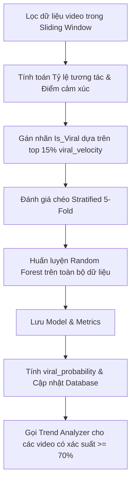

# Chat Conversation

Note: _This is purely the output of the chat conversation and does not contain any raw data, codebase snippets, etc. used to generate the output._

### User Input

model train Ai ngoại trừ llm đang sử dụng trong dự án là gì, sử dụng thuật toán gì, sử dụng các tham số gì và cho ra tham số gì, nguyên lý hoạt động

*Viewed [train_model.py](file:///c:/Users/saket/Codes/trendsense/services/ai_engine/train_model.py) *

*Listed directory [ai_engine](file:///c:/Users/saket/Codes/trendsense/services/ai_engine) *

*Viewed [prediction_engine.py](file:///c:/Users/saket/Codes/trendsense/services/ai_engine/prediction_engine.py) *

*Viewed [sentiment_engine.py](file:///c:/Users/saket/Codes/trendsense/services/ai_engine/sentiment_engine.py) *

*Viewed [trend_analyzer.py](file:///c:/Users/saket/Codes/trendsense/services/ai_engine/trend_analyzer.py) *

*Grep searched codebase*

*Grep searched codebase*

*Grep searched codebase*

### Planner Response

Mô hình AI huấn luyện nội bộ trong dự án (ngoại trừ các LLM/NLP bên ngoài) là **Mô hình dự báo khả năng viral của video** (Viral Prediction Model), được định nghĩa trong [train_model.py](file:///c:/Users/saket/Codes/trendsense/services/ai_engine/train_model.py) và chạy suy diễn tại [prediction_engine.py](file:///c:/Users/saket/Codes/trendsense/services/ai_engine/prediction_engine.py).

Chi tiết cụ thể về thuật toán, tham số và nguyên lý hoạt động của mô hình như sau:

### 1. Thuật toán sử dụng
Mô hình sử dụng thuật toán **[RandomForestClassifier](file:///c:/Users/saket/Codes/trendsense/services/ai_engine/train_model.py#L9)** từ thư viện `scikit-learn`. Đây là thuật toán học máy có giám sát dạng Ensemble Learning (học máy kết hợp), hoạt động bằng cách xây dựng một rừng gồm nhiều cây quyết định (Decision Trees) và tổng hợp kết quả của chúng để đưa ra dự báo.

---

### 2. Các tham số đầu vào (Features) & Siêu tham số (Hyperparameters)

#### A. Các thuộc tính đầu vào (Input Features - `X`)
Mô hình học từ các đặc trưng tương tác được định nghĩa tại biến **[FEATURES](file:///c:/Users/saket/Codes/trendsense/services/ai_engine/train_model.py#L19)**:
*   `Like_Rate`: Tỷ lệ lượt thích trên tổng số lượt xem (`likes / views`).
*   `Comment_Rate`: Tỷ lệ lượt bình luận trên tổng số lượt xem (`comments / views`).
*   `Share_Rate`: Tỷ lệ lượt chia sẻ trên tổng số lượt xem (`shares / views`).
*   `Save_Rate`: Tỷ lệ lượt lưu trên tổng số lượt xem (`saves / views`).
*   `Positive_Score`: Điểm số cảm xúc tích cực thu được từ bình luận của video (trích xuất từ mô hình NLP phân tích cảm xúc, mặc định là 50).
*   `Views_Per_Hour`: Số lượt xem trung bình mỗi giờ.

#### B. Siêu tham số cấu hình mô hình (Hyperparameters)
*   `n_estimators=100`: Tạo ra 100 cây quyết định độc lập trong rừng để bỏ phiếu.
*   `class_weight='balanced'`: Tự động điều chỉnh trọng số các lớp để xử lý tình trạng mất cân bằng dữ liệu (lớp video viral chiếm thiểu số 15%, lớp không viral chiếm đa số 85%).
*   `random_state=42`: Đảm bảo tính nhất quán và khả năng lặp lại (reproducibility) kết quả huấn luyện giữa các lần chạy.

---

### 3. Kết quả đầu ra (Outputs / Metrics)

*   **Xác suất Viral (`viral_probability`)**: Xác suất video đó thuộc lớp Viral (`Is_Viral = 1`), được chuyển đổi thành tỉ lệ phần trăm và giới hạn (clip) trong khoảng từ **`0%` đến `99.9%`** nhằm tránh mô hình tự tin quá mức (overfitting). Chỉ số này sẽ được cập nhật trực tiếp vào cơ sở dữ liệu (cột `viral_probability` của bảng `videos`).
*   **Feature Importances (Mức độ quan trọng của đặc trưng)**: Tỷ lệ phần trăm đóng góp của mỗi feature vào quyết định phân loại của mô hình.
*   **Các chỉ số đánh giá hiệu năng (Metrics)**:
    *   `accuracy`: Độ chính xác tổng thể.
    *   `precision`: Tỷ lệ dự báo chính xác trong số các video được dự báo là viral.
    *   `recall`: Tỷ lệ nhận diện được bao nhiêu phần trăm video thực sự viral.
    *   `f1`: Điểm F1-score (trung bình điều hòa giữa Precision và Recall).
    *   `auc`: Diện tích dưới đường cong ROC biểu thị khả năng phân tách giữa lớp viral và không viral.

---

### 4. Nguyên lý hoạt động (Workflow)

Nguyên lý huấn luyện và dự báo của mô hình được thực hiện thông qua hàm **[train](file:///c:/Users/saket/Codes/trendsense/services/ai_engine/train_model.py#L21)** theo các bước sau:

1.  **Thu thập dữ liệu**: Lọc các video được cào về trong khoảng thời gian Sliding Window gần nhất (định nghĩa bởi cấu hình hệ thống).
2.  **Tiền xử lý & Tính toán đặc trưng**: Thực hiện Feature Engineering để biến đổi các chỉ số đếm tĩnh (likes, shares, comments, saves) thành các tỷ lệ động tương ứng trên mỗi lượt xem, đồng thời xử lý các giá trị khuyết và vô cực (`NaN` / `inf`).
3.  **Tự động gắn nhãn (Auto-labeling)**:
    *   Mô hình tính toán ngưỡng phân vị 85% (`quantile(0.85)`) của chỉ số `viral_velocity` trên tập dữ liệu.
    *   Video nào có tốc độ lan truyền vượt ngưỡng này sẽ tự động được gán nhãn `Is_Viral = 1` (Viral), các video còn lại gán nhãn `0` (Không Viral).
4.  **Kiểm chứng chéo (Cross-Validation)**: Sử dụng phương pháp `StratifiedKFold` chia dữ liệu thành 5 phần để đánh giá mô hình khách quan trước khi huấn luyện chính thức.
5.  **Huấn luyện & Lưu trữ**:
    *   Mô hình được huấn luyện trên toàn bộ tập dữ liệu đã chuẩn bị.
    *   Lưu trữ mô hình và bộ metrics đánh giá thông qua hàm `save_model` vào thư mục `data/models/`.
6.  **Cập nhật xác suất**: Dự đoán xác suất cho toàn bộ dữ liệu hiện tại bằng hàm `predict_proba(X)[:, 1]`, chuyển sang phần trăm, giới hạn tối đa `99.9%` và cập nhật lại vào cột `viral_probability` của cơ sở dữ liệu.
7.  **Kết hợp Phân tích Xu hướng**: Sau khi cập nhật xong, hệ thống tự động kích hoạt **[run_trend_analysis](file:///c:/Users/saket/Codes/trendsense/services/ai_engine/trend_analyzer.py#L254)** để tổng hợp từ khóa/hashtag từ các video có xác suất viral cao (từ 70% trở lên).